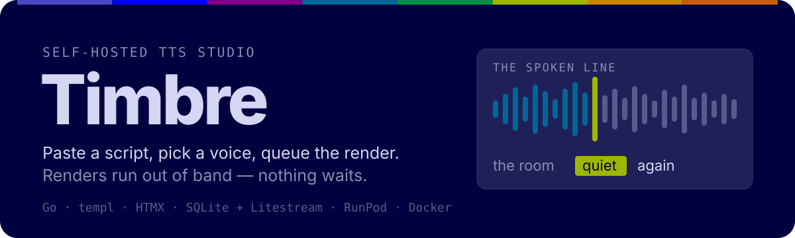
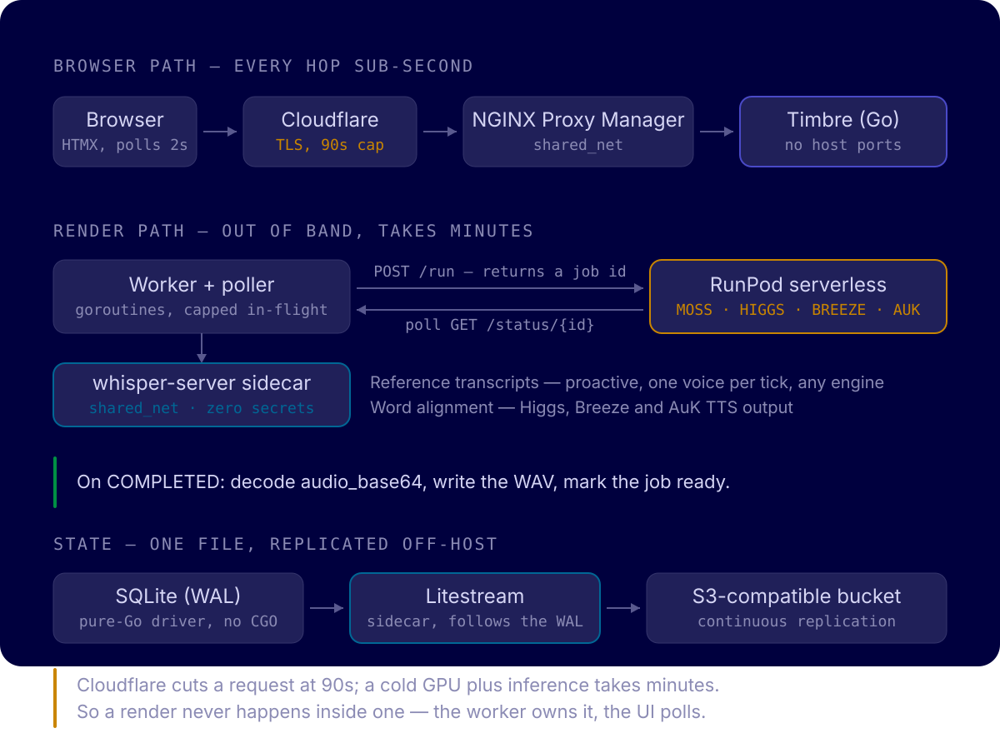

<p align="center">
  
</p>

**Timbre** is a self-hosted web front end for [MossTTS v1.5](https://github.com/sruckh/mossTTS-v1.5-runpod-serverless) running on a RunPod serverless endpoint. You paste a script, pick or clone a voice, queue renders, and download WAVs. The app owns the queue, the submission, the polling, and the audio.

> **Status: early.** The skeleton is deployed and the whole UI is gated behind login — it serves, migrates, replicates, injects secrets and authenticates. The studio features (voice library, queue, playback) are not written yet. [What works today](#what-works-today) is exact.

## Why it is built this way

Cloudflare cuts off any request at 90 seconds. A cold serverless GPU plus inference takes minutes. Those two facts are irreconcilable if the browser waits on the render — so it doesn't.

<p align="center">
  
</p>

The browser only ever talks to the Go app, in sub-second hops. A background worker submits to RunPod's async `/run` and a poller watches `/status/{id}`; when it reports `COMPLETED` the worker decodes `audio_base64`, writes the WAV and flips the job to `ready`. The UI finds out by polling the app, not RunPod. `/runsync` is unusable here for the same 90-second reason.

Two consequences worth knowing before you read the code:

- **The container publishes no ports.** It is reachable only on the `shared_net` Docker network, where NGINX Proxy Manager forwards a hostname to it and Cloudflare terminates TLS.
- **Reference audio needs a public URL.** RunPod's one-shot voice cloning takes `reference_url` — a URL its own workers fetch — so uploaded samples must be served from the public hostname, not an internal one.

## What works today

| | |
| --- | --- |
| ✅ HTTP server, `GET /healthz` → `{"ok":true}`, embedded static assets | Serving |
| ✅ SQLite schema — `users`, `voices`, `jobs`, `sessions` with constraints and indexes | Migrated on boot |
| ✅ Litestream sidecar replicating to an S3-compatible bucket | Continuous |
| ✅ Secrets injected from Infisical at container start | No secrets in the repo |
| ✅ Multi-stage Docker build — templ + Tailwind + `go build`, no host toolchain | `docker compose` only |
| ✅ Login, session, gated routes — bcrypt admin bootstrap, signed session cookie, everything but `/login`, `/healthz`, `/static/*`, `/refs/*` requires auth | Done |
| ⬜ Reference upload, public reference route, voice library | Not started |
| ⬜ Job queue, RunPod submission, polling, download, delete | Not started |
| ⬜ The studio UI | Not started |

The `jobs` table and the RunPod endpoint config already exist; the worker that uses them does not.

## Quick start

Everything builds and runs in Docker. There is no Go, Node, templ or SQLite toolchain on the host, and none is needed.

```bash
# 1. Set your deployment values. .env is git-ignored.
cp .env.example .env && $EDITOR .env

# 2. Put the machine identity for your secrets backend in the shell.
. scripts/env.sh

# 3. Build (--profile tools also builds the test image) and start.
docker compose --profile tools build
docker compose up -d

# 4. Confirm it is answering.
docker compose exec app wget -qO- http://localhost:8080/healthz
# => {"ok":true}
```

On first boot the app seeds the admin user from `ADMIN_USERNAME`/`ADMIN_PASSWORD` (injected by Infisical, or `.env` when running without it) and logs `admin user created` — never the password. Every page except `/login`, `/healthz`, `/static/*` and `/refs/*` then redirects to `/login` until you sign in.

Run the tests:

```bash
docker compose run --rm test go test ./...
```

Use the **`test`** service, not `app` — the `app` image is a slim alpine runtime with no Go toolchain in it.

You will need an external Docker network named `shared_net` (`docker network create shared_net` if you do not already have one) and an NGINX Proxy Manager entry pointing your hostname at `timbre-app:8080`.

## Configuration

Read from the environment at startup:

| Variable | Default | Purpose |
| --- | --- | --- |
| `TIMBRE_ADDR` | `:8080` | Listen address. Not published to the host. |
| `TIMBRE_DB_PATH` | `/data/timbre.db` | SQLite file, on the volume Litestream shares. |
| `TIMBRE_AUDIO_DIR` | `/data/audio` | Rendered WAVs and uploaded reference samples. |
| `TIMBRE_PUBLIC_BASE_URL` | — | Public hostname, e.g. `https://timbre.example.com`. Reference URLs are built from it, so it must be the externally reachable name. |
| `RUNPOD_ENDPOINT` | — | Your endpoint, e.g. `https://api.runpod.ai/v2/your-endpoint-id`. Server-side only; never handed to the browser. |
| `RUNPOD_API_KEY` | — | Injected by Infisical at container start. |
| `ADMIN_USERNAME` | — | Seeds the first admin user on startup (only when the users table is empty). Injected by Infisical. |
| `ADMIN_PASSWORD` | — | Password for that bootstrap admin, bcrypt-hashed at rest. Injected by Infisical. |
| `TIMBRE_SESSION_SECRET` | — | Keys the HMAC that signs session cookies. Injected by Infisical; if unset, sessions are forgotten on restart. |
| `TIMBRE_MAX_IN_FLIGHT` | `2` | How many jobs the worker keeps submitted at once. |

`RUNPOD_API_KEY`, the three auth secrets above and the replication credentials come from [Infisical](https://infisical.com) via the container entrypoint, which trades a Universal Auth machine identity for a short-lived token and runs the app under `infisical run`. Nothing is baked into an image layer.

One consequence that costs people an afternoon: `infisical run` injects into the **app process**, not the container. A fresh `docker compose exec` shell will not see `RUNPOD_API_KEY` even when injection worked. Check the process instead:

```bash
docker compose exec -T app sh -c \
  'for p in /proc/[0-9]*; do tr "\0" "\n" < $p/environ 2>/dev/null \
     | grep -q "^RUNPOD_API_KEY=." && echo present && break; done'
```

## Design system

Timbre has a written design system with an unusually strict rule: **ten colors, and nothing else.** Every other value is a `color-mix()` of two of them — no neutral gray, no sampled hex.

| | | | | |
| --- | --- | --- | --- | --- |
| `#00003E` Ink | `#D5D5F4` Paper | `#4A4AC8` Indigo | `#9EB600` Olive | `#006795` Teal |
| `#C98500` Amber | `#009044` Green | `#C95D00` Burnt | `#83008C` Purple | `#0000FF` Blue |

Olive is the brightest value against Ink, so it marks the word being spoken *right now* and doubles as the focus ring. Amber → Green is the render lifecycle. Burnt is refusal, not danger. Blue appears exactly once, in the masthead spectrum, where nothing depends on reading it.

- [`DESIGN.md`](./DESIGN.md) — the full system: palette rationale, measured contrast, type scale, components.
- [`index.html`](./index.html) — the living reference; the system rendered in itself.

The build compiles `internal/web/input.css` to `app.css` with the Tailwind v4 CLI and **does not minify it**, deliberately: the minifier folds `color-mix()` into computed hexes, which would put colors in the output that belong to no palette.

## Layout

```
cmd/timbre/          entry point, graceful shutdown
internal/config/     environment config; reports key presence, never the value
internal/db/         driver, pragmas, schema, migrations
internal/auth/       bcrypt, admin bootstrap, SQLite-backed sessions, middleware
internal/server/     chi router, login/logout, /healthz, static assets, templ shell
internal/web/        templ layout + login page + Tailwind theme (compiled CSS is embedded)
docker/entrypoint.sh Infisical login, then exec the app under `infisical run`
scripts/             env.sh (load identity), sync-generated.sh (LSP support)
```

`AGENTS.md` is the operating contract for AI agents working in this repo — build commands, the secret-injection caveat, and the CSS rules live there.

## Notes

- **Editor tooling.** `scripts/sync-generated.sh` copies `go.mod`, `go.sum`, `*_templ.go` and the compiled `app.css` out of the build image so `gopls` can resolve the tree. Generation still only happens in Docker. Re-run it after touching a `.templ` file, `input.css`, or imports.
- **Streaming.** RunPod exposes `/stream/{id}`; Timbre targets the non-streaming path first. Streaming playback is secondary.

## License

This project is licensed under the Apache 2.0 License. MOSS-TTS-v1.5 weights are subject to OpenMOSS Community License terms.

See [`LICENSE`](./LICENSE).
